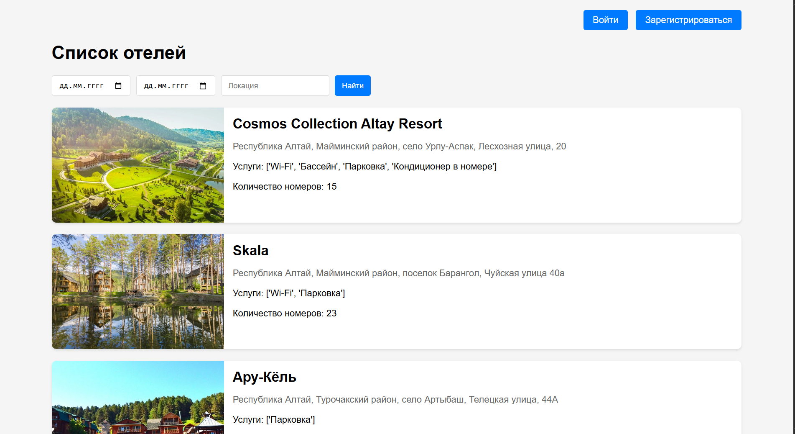
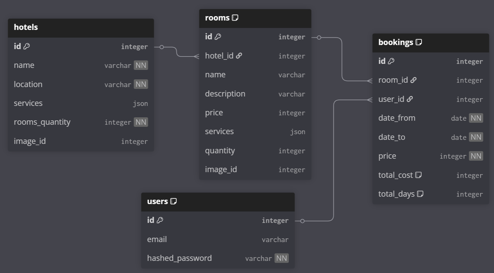
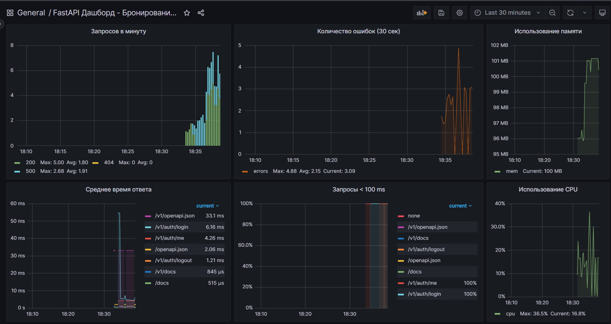

# FastAPI Hotel Booking Service

Современный асинхронный backend-сервис для бронирования отелей.

Production-ready пример приложения на FastAPI с полноценной инфраструктурой: асинхронная работа с БД, фоновые задачи, мониторинг, кэширование, обработка изображений, отправка email и админ-панель.



*(пример главной страницы фронтенда)*



*(схема базы данных)*
---

## ✨ Основные возможности

- Регистрация / авторизация (JWT)
- Поиск и фильтрация отелей
- Бронирование номеров с проверкой дат и доступности
- Загрузка и обработка фотографий отелей (Celery + Pillow / async)
- Отправка email-подтверждений (асинхронно)
- Админ-панель для управления сущностями
- Полноценный мониторинг (Prometheus + Grafana)
- Автоматическая документация (Swagger)

---

## 🚀 Технологический стек

- **FastAPI** — основной фреймворк
- **PostgreSQL + asyncpg** — основная БД
- **SQLAlchemy 2.0 (async)** — ORM
- **Alembic** — миграции
- **Celery + Redis** — фоновые задачи
- **Redis** — кэш и брокер
- **Prometheus + Grafana** — метрики и дашборды
- **Docker & Docker Compose** — контейнеризация
- **flake8 + black + isort** — кодстайл
- **sqladmin** — админка 
---

## 📁 Структура проекта

```text
.
├── app/               
│   ├── admin/         # админ-панель
│   ├── bookings/      # бронирования
│   ├── dao/           # шаблонные запросы
│   ├── hotels/        # отели и номера
│   ├── images/        # обработка изображений
│   ├── migrations/    # alembic миграции
│   ├── pages/         # эндпоинты для фронтенда
│   ├── prometheus/    # тестовые эндпоинты для grafana
│   ├── templates/     # jinja2 шаблоны
│   ├── users/         # пользователи и аутентификация
│   ├── tasks/         # celery задачи
│   ├── static/        # статика
│   ├── config.py
│   ├── conftest.py
│   ├── database.py
│   ├── exceptions.py
│   ├── logger.py
│   └── main.py           
│
├── docker/             
│   ├── app.sh
│   └── celery.sh
├── alembic.ini            
├── docker-compose.yaml
├── Dockerfile
├── requirements.txt
├── .gitignore
├── pytest.ini
├── prometheus.yml
├── pyproject.toml
├── db.png
├── README.md
└── grafana-dashboard.json

```

---

## ⚙️ Переменные окружения

Создай файл `.env` в корне проекта:

```env
MODE=DEV
LOG_LEVEL=INFO

DB_HOST=localhost
DB_PORT=5432
DB_USER=postgres
DB_PASS=your_password_db
DB_NAME=postgres

TEST_DB_HOST=localhost
TEST_DB_PORT=5432
TEST_DB_USER=postgres
TEST_DB_PASS=your_password_db
TEST_DB_NAME=test_booking_db

SECRET_KEY=your_secret_key
ALGORITHM=HS256
```
Также создай файл `.env-non-dev` в корне проекта:

```env
MODE=DEV
LOG_LEVEL=INFO

DB_HOST=db
DB_PORT=5432
DB_USER=postgres
DB_PASS=your_db_password
DB_NAME=booking_app

POSTGRES_DB=booking_app
POSTGRES_USER=postgres
POSTGRES_PASSWORD=your_postgresdb_password


SECRET_KEY=your_secret_key
ALGORITHM=HS256


SMTP_PASS="your_smtp_pass"
SMTP_HOST=smtp.gmail.com
SMTP_PORT=465
SMTP_USER=your_gmail.com

REDIS_HOST=redis
REDIS_PORT=6379
```

> ❗ `.env` **не должен коммититься**  
> Для GitHub используется `.env.example`

---


## 🗄 Миграции базы данных

Создать миграцию:
```bash
alembic revision --autogenerate -m "message"
```

Применить:
```bash
alembic upgrade head
```

---

## 🐳 Запуск проекта (Docker)

### Сборка и запуск
```bash
docker compose up --build -d
```

### Остановить
```bash
docker-compose down
```

После запуска:
- API + Swagger: http://localhost:8081/v1/docs
- Prometheus: http://localhost:9090
- Grafana: http://localhost:3000
- Flower: http://localhost:5555

---

## 🔄 Фоновые задачи (Celery)

Celery используется для:
- обработки изображений
- отправки уведомлений

Redis используется как брокер.

---

## 📊 Мониторинг

- **Prometheus** собирает метрики FastAPI
- **Grafana** отображает дашборды
- готовый дашборд лежит в `grafana-dashboard.json`



*(Дашборд Grafana)*

---

## 👨‍💻 Автор

Проект создан как учебный и демонстрационный backend‑сервис.

